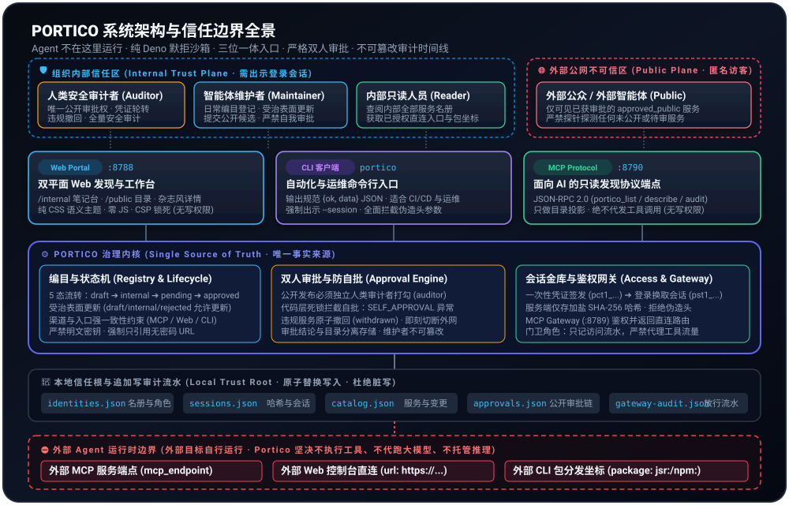

# 核心架构与信任边界

<p align="center">
  
</p>

Portico 的系统架构围绕**信任边界划分**与**严格权限隔离**构建。

---

## 系统拓扑与进程划分

Portico 运行时包含三个相互独立的常驻服务进程，由 Supervisor（`src/up/main.ts`）统一监控。进程间不存在共享内存或可执行代码交叉引用，各自遵循最严苛的操作系统级权限沙箱：

```text
                               ┌─────────────────────────────┐
                               │   Supervisor (deno task up) │
                               └──────────────┬──────────────┘
                    ┌─────────────────────────┼─────────────────────────┐
                    │ (fork/pipe)             │ (fork/pipe)             │ (fork/pipe)
                    ▼                         ▼                         ▼
      ┌──────────────────────────┐┌──────────────────────────┐┌──────────────────────────┐
      │      Portal Process      ││     Gateway Process      ││       MCP Process        │
      │   (HTTP :8788, Read-Only)││   (HTTP :8789, Append)   ││   (HTTP :8790, Read-Only)│
      │ 权限: --allow-read        ││ 权限: --allow-read       ││ 权限: --allow-read        │
      │       --allow-env        ││       --allow-write      ││       --allow-env        │
      │       --allow-net=127... ││       --allow-env        ││       --allow-net=127... │
      │ 严格无 --allow-write     ││       --allow-net=127... ││ 严格无 --allow-write     │
      └─────────────┬────────────┘└─────────────┬────────────┘└─────────────┬────────────┘
                    │                           │                           │
                    └───────────────────────────┼───────────────────────────┘
                                                ▼
                               ┌─────────────────────────────┐
                               │  Local Trust Root (Files)   │
                               │  - catalog.json             │
                               │  - identities.json          │
                               │  - sessions.json            │
                               │  - approvals.json           │
                               │  - gateway-audit.json       │
                               └─────────────────────────────┘
```

### 1. Portal 进程 (`src/portal/main.ts`)
- **端口**：默认 `8788`。
- **定位**：Web 门户页面与只读 REST API。
- **安全沙箱**：**绝不授予 `--allow-write` 写权限**。即使页面层存在未知漏洞，攻击者也物理上无法通过 Portal 篡改底层目录或身份文件。

### 2. Gateway 进程 (`src/gateway/main.ts`)
- **端口**：默认 `8789`。
- **定位**：MCP 服务的安全准入网关与访问路由。
- **安全沙箱**：授予 `--allow-write` 仅用于向 `gateway-audit.json` 追加访问流水；**不代理流量，不执行工具，不代发模型推理**。

### 3. MCP 进程 (`src/mcp/main.ts`)
- **端口**：默认 `8790`。
- **定位**：面向 AI 智能体的只读发现协议端点（JSON-RPC 2.0）。
- **安全沙箱**：同 Portal 一样，**绝无 `--allow-write` 权限**，只作为治理状态的目录投影。

---

## 两大信任边界

Portico 将整个系统严格划分为两个不可妥协的信任区域：

```text
               [ 组织内部信任区 (Internal) ]              │     [ 外部公网不可信区 (Public) ]
                                                        │
┌──────────────┐         ┌──────────────┐               │
│ Agent 维护者  │ ───►   │ Catalog 内核  │               │
│ (Maintainer) │ register│ (记录状态为   │               │
└──────────────┘         │  internal)   │               │
                         └──────┬───────┘               │
                                │                       │
                                │ publish public        │
                                ▼                       │
                         ┌──────────────┐               │
                         │ pending_public│               │
                         │ (公开候选)    │               │
                         └──────┬───────┘               │
                                │                       │
                     approve    ▼                       │
               ┌────────────────────────┐               │
               │ 人类审计者 (Auditor)    │ ──────────────┼──────────────► [ 批准公开 ]
               │ 签署审批记录至 approvals │   通过审批     │                │
               └────────────────────────┘               │                ▼
                                                        │         ┌──────────────┐
                                                        │         │approved_public│
                                                        │         │ 全网匿名可达  │
                                                        │         └──────────────┘
```

### 信任边界 A：内部与公开边界
- **内部登记（Internal）**：仅对组织内已鉴权身份（具有登录会话的 Reader / Maintainer / Auditor）可见。未通过鉴权的匿名访客完全无法感知内部服务的存在。
- **公开候选（Pending Public）**：维护者提交公开申请后，服务进入候选状态，此时对外依然保持绝对不可见。
- **公开批准（Approved Public）**：必须经由持有 `auditor` 角色的独立自然人审计者显式批准。批准通过后，外部匿名请求方可在 Portal、CLI、MCP 发现该入口。

### 信任边界 B：维护权与审计权边界
- **维护者（Maintainer，人类或 Agent）**：拥有登记服务、更新描述、提交公开的权力；**严禁批准自己提交的公开请求，严禁自封 Auditor 角色，严禁删除审计时间线**。
- **审计者（Auditor，仅限人类）**：拥有批准或拒绝公开、撤回已公开服务、作废危险凭证与注销身份的特权；**不直接参与日常业务代码维护**。

---

## 联动退出与原子恢复保证

在系统监督器架构中：
1. **协同崩溃退出**：Portal、Gateway、MCP 三大子进程中的任意一个发生未捕获异常退出，Supervisor 会通过 SIGTERM 级联关闭其余所有存活进程，杜绝留下只有部分入口可用的“半死系统”。
2. **写操作故障零脏写**：所有修改底层 JSON 文件的操作均遵循原子写入协议（先写临时文件 `.tmp`，再执行原子性系统重命名 `renameSync`）。任何校验失败、权限拦截或断电异常均保证原始状态文件字节不变。
